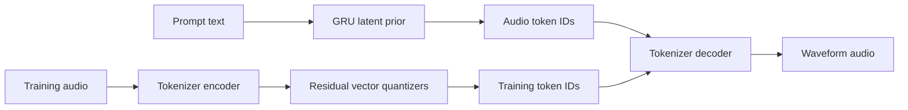

# Fidelo AI Architecture Guide

This guide explains the architecture shown in [index.html](index.html) in more depth, using the current Python implementation as the source of truth. It is written for readers who are new to machine learning and audio generation.

## The big idea

Fidelo is a **two-stage latent audio generation system**:

1. An **audio tokenizer** learns to compress waveform audio into discrete token IDs and reconstruct audio from those IDs.
2. A **text-conditioned prior** learns to predict sequences of audio token IDs from a text prompt.

The system does not ask one model to generate every audio sample directly. At 44,100 samples per second, that would require predicting 44,100 values for every second of mono audio. Instead, it first converts audio into a slower sequence of discrete tokens.

A useful analogy is:

- the tokenizer invents a vocabulary for sound
- the prior writes a sequence using that vocabulary
- the decoder reads the sequence aloud as audio



## Current saved model versus code defaults

Some values in `index.html` describe code defaults, while the currently saved bundles use different values. The saved `config.json` files are the authority for a particular checkpoint.

| Setting | General code default | Current saved tokenizer and prior |
|---|---:|---:|
| Sample rate | 44,100 Hz | 44,100 Hz |
| Clip length | 5.0 seconds in shared config | 3.33 seconds |
| Encoder channels | 128, 256, 512 | 128, 256, 512 |
| Encoder strides | 4, 4, 2 | 4, 4, 2 |
| Total temporal stride | 32 | 32 |
| Latent dimension | 384 | 384 |
| Codebook size per quantizer | 4,096 | 2,048 |
| Number of residual quantizers | 1 | 2 |
| Residual blocks per stage | 3 in shared config | 2 |
| Pre-quant blocks | 2 | 2 |
| Post-quant blocks | 3 | 2 |
| GRU hidden size | 768 | 768 |
| GRU layers | 3 | 3 |
| Text embedding size | 256 | 256 |

The visual page now uses the current saved value of `2,048`. For another checkpoint, treat the saved `codebook_size` as $K$ and derive the BOS IDs from it.

## Important tensor notation

The code uses compact shape labels:

- `B`: batch size, or how many examples are processed together
- `C`: channels or feature dimensions
- `T`: number of latent time steps
- `Q`: number of residual quantizers or code streams
- `N`: number of waveform samples

Important shapes are:

- waveform: `[B, 1, N]`
- continuous latent features: `[B, 384, T]`
- one code stream: `[B, T]`
- multiple code streams: `[B, Q, T]`

For a 3.33-second clip at 44.1 kHz, the input contains about 146,853 waveform samples. The encoder stride is:

$$4 \times 4 \times 2 = 32$$

so the latent sequence contains roughly:

$$T \approx \left\lceil \frac{146{,}853}{32} \right\rceil = 4{,}590$$

This is temporal compression, but each latent step is still a rich 384-dimensional vector.

# Stage A: the audio tokenizer

The tokenizer is a **vector-quantized autoencoder**, usually shortened to **VQ autoencoder**.

An autoencoder has two main halves:

- the **encoder** compresses an input
- the **decoder** reconstructs the input from the compressed representation

The vector quantizer between them forces the representation to use a finite vocabulary of learned vectors instead of arbitrary continuous values.

## 1. Audio preparation

Dataset rows connect an audio filename with descriptive text. During loading, audio is:

1. decoded with `soundfile` or `torchaudio`
2. mixed down to mono if it has multiple channels
3. resampled to 44.1 kHz when needed
4. clamped to the range `[-1, 1]`
5. cropped or zero-padded to the configured clip length

Random cropping can expose different portions of a long recording during training. A centered crop is used by reconstruction tests for repeatability.

## 2. Convolutional encoder

The encoder processes the waveform using one-dimensional convolutions. A `Conv1d` filter slides along time and learns local audio patterns such as edges, oscillations, attacks, and texture.

The main channel progression is:

```text
1 waveform channel -> 128 -> 256 -> 512 -> 384 latent channels
```

The three stages use strides `4`, `4`, and `2`. A stride larger than one reduces the timeline. Together they make the latent timeline 32 times shorter than the waveform timeline.

Each stage also contains residual convolution blocks. A residual block computes a transformation and adds the original input back:

$$y = \operatorname{GELU}(x + f(x))$$

The shortcut helps gradients travel through a deep network and lets a block learn a correction instead of rebuilding the entire representation.

The blocks use:

- `Conv1d` for temporal pattern recognition
- `GroupNorm` for stable feature scaling
- `GELU` as a smooth nonlinear activation
- dilated convolutions to inspect a wider time neighborhood without downsampling again

After downsampling, bottleneck residual blocks further process the 384-channel latent representation.

## 3. Pre-quant processing

Before discretization, additional residual blocks refine the encoder output. Their job is to shape the continuous latent vectors into a form that can be represented well by the learned codebooks.

This boundary is important: reconstruction quality depends not only on decoder power, but also on whether encoder vectors lie near useful codebook entries.

## 4. Vector quantization

A codebook is a learned table of vectors. In the current saved model, each codebook contains 2,048 vectors, and every vector has 384 values.

For each latent time step, the quantizer computes the squared Euclidean distance to every codebook vector and selects the closest one:

$$k^* = \arg\min_k \lVert z - e_k \rVert_2^2$$

where:

- $z$ is the continuous encoder vector
- $e_k$ is codebook entry $k$
- $k^*$ is the selected token ID

The discrete ID is what the prior later learns to predict.

### Why quantization is difficult

Choosing the nearest code with `argmin` is not differentiable. A tiny input change can suddenly switch the winning ID. The implementation uses a **straight-through estimator**:

- the forward pass uses the quantized codebook vector
- the backward pass treats the quantization step approximately like an identity operation

This lets reconstruction gradients reach the encoder even though the forward representation is discrete.

## 5. Residual vector quantization

The current saved tokenizer uses two quantizers. This is **residual vector quantization**, or **RVQ**.

The first quantizer approximates the encoder latent. The remaining error is:

$$r_1 = z - q_1(z)$$

The second quantizer represents that error:

$$\hat{z} = q_1(z) + q_2(r_1)$$

A beginner-friendly analogy is drawing an image in two passes:

- the first codebook paints the broad approximation
- the second codebook paints some of what the first pass missed

With two quantizers, every latent time step has two token IDs. During decoding, their codebook vectors are added together.

More quantizers can improve representational capacity, but they also increase:

- token storage
- prior output heads
- prediction difficulty
- training and inference work

## 6. VQ losses

Each quantizer has two related losses.

The **codebook loss** moves selected codebook vectors toward encoder outputs:

$$L_{codebook} = \lVert e - \operatorname{stopgrad}(z) \rVert_2^2$$

The **commitment loss** encourages encoder outputs to stay near their selected vectors:

$$L_{commit} = \lVert \operatorname{stopgrad}(e) - z \rVert_2^2$$

They are combined as:

$$L_{VQ} = L_{codebook} + \beta L_{commit}$$

The commitment cost $\beta$ defaults to `0.1`. A larger value pushes the encoder more strongly toward codebook vectors, but setting it too high can restrict useful encoder variation.

For multiple residual quantizers, their VQ losses are averaged.

## 7. Post-quant processing and decoder

The selected codebook vectors pass through post-quant residual blocks. The convolutional decoder then reverses the encoder's compression using transposed convolutions.

Its broad channel path is:

```text
384 latent channels -> 512 -> 256 -> 128 -> 1 waveform channel
```

The final `tanh` limits output values to approximately `[-1, 1]`. The result is trimmed or padded to exactly match the desired waveform length.

## 8. Tokenizer training objective

The tokenizer is trained with a weighted sum of three losses:

$$L = w_{recon}L_{L1} + w_{VQ}L_{VQ} + w_{STFT}L_{STFT}$$

### Waveform L1 loss

$$L_{L1} = \operatorname{mean}(|\hat{x} - x|)$$

This compares reconstructed and original samples directly. It encourages correct timing and amplitude, but waveform samples can disagree strongly when phase shifts are small to human hearing.

### Multi-resolution STFT loss

An STFT, or **short-time Fourier transform**, describes how frequency content changes over time. The trainer compares magnitude and log-magnitude spectra using FFT sizes 256, 512, and 1024.

Multiple resolutions matter because:

- short windows represent fast transients well
- longer windows represent frequency detail well
- log magnitude gives quieter spectral components more influence

The default STFT weight is `0.35`.

### Why listening still matters

MAE and MSE measure sample-level error, not musical quality. Two reconstructions can have similar numerical errors while differing in brightness, phase, noise, transients, or perceived clarity. Use metrics for consistent comparison, but also listen to fixed test clips.

## 9. Fine-tuning an extra residual quantizer

The current trainer can expand a one-quantizer checkpoint to two quantizers. During the default residual fine-tuning warmup, it freezes:

- the encoder
- pre-quant blocks
- existing quantizers

It continues training:

- newly added quantizers
- post-quant blocks
- decoder

This protects useful existing representations while the new residual codebook learns the error left by the first codebook. After the warmup, the full tokenizer can adapt together.

## 10. Tokenizer optimization and checkpoints

Tokenizer training uses:

- AdamW optimization
- gradient accumulation
- global gradient clipping at norm `1.0`
- CUDA automatic mixed precision when CUDA is used
- a validation split

The trainer writes:

- `audio_tokenizer.pt`: latest tokenizer state
- `best_audio_tokenizer.pt`: lowest weighted validation score
- `tokenizer_epoch_XXX.pt`: per-epoch snapshots
- `config.json`: architecture and dataset settings

Fine-tuning defaults to a lower learning rate than training from scratch. The architecture-aware checkpoint loader also maps older single-quantizer names and allows newly added residual quantizers to start with new weights.

# Stage B: the text-conditioned latent prior

The prior learns the probability of the next audio token given earlier tokens and a prompt. It is **autoregressive** because each new prediction depends on previous tokens.

It is not a Transformer. It is a **GRU**, or **gated recurrent unit**, which is a recurrent neural network.

## 1. The tokenizer is frozen

During prior training, the trained audio tokenizer is loaded in evaluation mode and its parameters have gradients disabled.

Each training waveform is converted into token IDs. The prior learns those IDs, but tokenizer weights do not change.

This separation is essential. If tokenizer code meanings change after prior training, the prior may produce IDs whose new meanings differ from what it learned. A materially changed or newly expanded tokenizer therefore requires compatible prior retraining or fine-tuning.

## 2. Text representation

The text system is deliberately simple:

1. lowercase text
2. extract words using a regular expression
3. map words to learned integer IDs
4. truncate or pad to at most 40 tokens
5. look up a 256-dimensional embedding for each word
6. average non-padding word embeddings
7. apply a learned linear layer and `tanh`

The result is one 256-dimensional vector for the whole prompt.

This is a **bag-like pooled representation**. It captures learned word information, but averaging does not preserve word order strongly. For example, prompts containing the same words in a different order begin with the same average before the projection.

This model does not use a pretrained language model, cross-attention, or a Transformer text encoder.

## 3. Audio token embeddings

Each residual quantizer stream has its own learned token embedding table. At one time step, embeddings from all streams are summed and divided by $\sqrt{Q}$:

$$h_{code} = \frac{1}{\sqrt{Q}}\sum_{q=1}^{Q} E_q(c_q)$$

The scaling keeps the combined magnitude from growing too quickly as more streams are added.

### Regular audio IDs versus the two BOS IDs

The prior input vocabulary has three roles. If the codebook size is $K$:

| Token role | ID range | Produced by tokenizer? | Predicted by prior? | Decoded as audio? |
|---|---:|---|---|---|
| Regular audio tokens | $0$ through $K-1$ | Yes | Yes | Yes |
| Regular BOS | $K$ | No | No | No |
| Song-beginning BOS | $K+1$ | No | No | No |

For the current saved model, $K=2{,}048$. Regular audio IDs are therefore `0..2047`, regular BOS is `2048`, and song-beginning BOS is `2049`.

Both BOS values are **input-only control symbols** in each prior code-embedding table. The embedding tables have $K+2$ rows, but each output head still has exactly $K$ logits. Consequently, sampling can only produce real audio IDs, and neither BOS value is ever sent to the tokenizer decoder.

The two BOS values mean different things:

- **regular BOS** says “start an ordinary or continuation clip without a latent prefix”
- **song-beginning BOS** says “start a clip taken from the actual beginning of a song”

During training, the CSV column `song_beginning` selects the first input symbol independently for every sample. True values use song-beginning BOS; missing, false, or empty values use regular BOS. Beginning-labelled audio is cropped from sample zero so its label remains truthful. After the first step, both kinds of examples consume the same regular teacher-forced audio IDs, allowing the GRU state to transition naturally from an opening into ordinary musical development.

## 4. GRU sequence model

At every time step, the model concatenates:

- the 384-dimensional combined audio-code embedding
- the same 256-dimensional pooled text vector

This produces a 640-dimensional GRU input. The current architecture uses:

- 3 GRU layers
- hidden size 768
- dropout 0.15 between GRU layers

A GRU carries a hidden state through time. That hidden state acts as its memory of earlier tokens. Unlike a Transformer, it processes generation recurrently rather than attending directly to every earlier position.

## 5. Output heads and teacher forcing

Each quantizer stream has a separate output head. With the current saved model, each GRU time step produces two distributions, each over 2,048 possible IDs.

During training, the true code sequence is shifted right:

```text
Regular clip input:    REGULAR_BOS,   code_1, code_2, ...
Song-start clip input: BEGINNING_BOS, code_1, code_2, ...
Both targets:                         code_1, code_2, code_3, ...
```

This is **teacher forcing**: the model receives the real previous code instead of its own possibly incorrect prediction.

Cross-entropy loss rewards high probability on the correct next ID. For multiple streams, logits and targets are flattened so every stream and time step contributes to the loss.

## 6. What the prior learns and does not learn

The prior learns patterns such as:

- which code transitions are common
- how token patterns develop over time
- statistical relationships between prompt words and audio codes

It does not directly understand waveform frequency, phase, or loudness. Those qualities are encoded indirectly through the token meanings learned by the tokenizer.

The prior also does not guarantee long-form musical structure. Its text representation is fixed for the entire clip, and its recurrent hidden state must carry temporal context.

# Inference: prompt to WAV

Inference loads three trained artifacts:

- the audio tokenizer and its config
- the latent prior and its config
- the saved word tokenizer

The tokenizer and prior must agree on codebook and quantizer structure. A prior trained for old tokenizer semantics should not be assumed compatible merely because tensor shapes load.

## 1. Autoregressive sampling

Generation starts with regular BOS or song-beginning BOS. The generation scripts use song-beginning BOS for the first output clip by default. `--beginning-bos-clips N` applies it to the first $N$ clips, while `--beginning-bos-clips 0` disables it. This flag changes only the prior's initial input symbol; it does not insert an audible token into the output.

When a generation window already has latent prefix codes, those real audio IDs establish the GRU state. The generator does not inject song-beginning BOS again inside that prefixed window.

For every latent time step:

1. embed the previous code or codes
2. concatenate the pooled prompt vector
3. update the GRU hidden state
4. produce logits for each code stream
5. filter and sample the next IDs
6. feed the sampled IDs into the next step

The sampling controls are:

- **temperature**: rescales certainty; lower is more deterministic, higher is more varied
- **top-k**: only retains the `k` highest-logit choices
- **top-p**: retains a high-probability set whose cumulative probability reaches a threshold
- **repetition penalty**: lowers scores for recently used IDs
- **repetition window**: controls how far back repetition checking looks

These controls change selection from the learned distribution; they do not improve the tokenizer's ability to reconstruct audio.

## 2. Retrieval guidance

The basic inference script optionally uses prompt-matched dataset audio as retrieval guidance.

It:

1. ranks dataset descriptions by word overlap with the prompt
2. encodes selected real clips into token sequences
3. generates a proposal window with the prior
4. searches retrieved code windows
5. scores windows using continuity, proposal agreement, token diversity, and prompt match
6. substitutes the best retrieved window when one is available

This is important: retrieval guidance is not neural attention and does not update model weights. It is an external generation-time selection procedure. Because it can insert token windows encoded from real dataset clips, output may follow retrieved material more directly than unguided prior sampling.

BOS conditioning and retrieval metadata are separate controls. BOS changes the prior's initial hidden-state trajectory. Retrieval guidance selects real code windows from dataset audio. In the structured generator, sources marked `song_beginning=1` are restricted to intro sections, while body and outro sections use regular sources. Increasing `--beginning-bos-clips` does not make beginning-labelled retrieval audio eligible for later sections.

## 3. Decoding and final audio processing

Predicted code IDs are looked up in the tokenizer codebooks. With multiple quantizers, stream vectors are summed. Post-quant blocks and the decoder turn those vectors into waveform audio.

For multiple clips, the script joins waveforms with a configurable crossfade, defaulting to 40 ms. It then:

- trims to the requested duration
- removes the waveform mean to reduce DC offset
- limits peaks to 0.98
- moves RMS toward 0.14 with gain limited to 1.5
- writes a mono WAV file

This loudness processing can make output easier to hear, but it cannot restore musical or spectral information that the tokenizer failed to preserve.

# Precision and numerical types

## FP32

Model parameters, saved checkpoints, ordinary inference, validation, and many sensitive operations use 32-bit floating point.

## Automatic mixed precision

On CUDA, training enters a PyTorch autocast region. Eligible convolutions, matrix multiplications, linear layers, and GRU operations may use lower precision for speed and memory savings. PyTorch keeps operations in higher precision where appropriate.

## Gradient scaling

Small half-precision gradients can underflow toward zero. `GradScaler` temporarily multiplies the loss, then unscales gradients before clipping and the optimizer step.

## Integer IDs

Text IDs and audio code IDs use integer tensors, normally `int64`. An ID is just an index into an embedding or codebook table; it is not a continuous audio value. Regular audio IDs index both prior embeddings and tokenizer codebooks. The two BOS IDs index only the prior's expanded input embeddings and are outside the decoder's valid audio-token range.

# How to diagnose the system

## First test the tokenizer

Run reconstruction on real audio:

```powershell
python .\test_latent_tokenizer_reconstruction.py
```

This path performs:

```text
real waveform -> encoder -> code IDs -> codebook lookup -> decoder -> reconstruction
```

If reconstruction is already noisy, dull, unstable, or missing detail, the tokenizer is the bottleneck. The prior cannot generate information that the decoder cannot reproduce from valid tokens.

## Then test the prior

Once reconstruction is acceptable, compare:

- reconstruction from real audio codes
- unguided prior generation
- retrieval-guided generation

Interpretation:

- poor reconstruction points to the tokenizer
- good reconstruction but poor unguided generation points mainly to the prior or conditioning
- unguided output poor but retrieval output good suggests retrieval is compensating for prior weakness
- both generation modes poor despite good reconstruction suggests token modeling, prompt conditioning, or sampling problems

## Use fixed evaluation inputs

Architecture experiments should reconstruct the same clips with the same crop and checkpoint selection. Otherwise, differences in source material can look like model improvements or regressions.

MAE and MSE are useful for controlled comparisons:

- **MAE** averages absolute sample error
- **MSE** squares errors, so large errors matter more

Neither metric fully represents perceived audio quality. Spectral metrics and listening tests add necessary context.

# Common beginner questions

## Is this a language model for music?

In a broad sense, the prior behaves like a small language model over audio tokens. However, it uses a GRU rather than a Transformer, and its vocabulary was learned from audio reconstruction rather than human language.

## Does one audio token equal one note?

No. A token is the nearest learned latent vector at a short time step. It may represent a mixture of timbre, phase, local rhythm, pitch content, and texture. Token meanings are learned and are not assigned musical labels.

## Does song-beginning BOS contain or decode an intro sound?

No. It is a learned prior input embedding, not an audio codebook entry. It influences which first real audio IDs the GRU predicts and how its hidden state develops. Any audible intro behavior comes from regular audio tokens that the model learned to associate with that control symbol.

## Why not generate waveform samples directly?

The token sequence is much shorter and discrete. This makes sequence modeling more manageable, although the prior still sees thousands of latent steps per clip.

## Does adding more codebooks always improve sound?

No. Extra residual quantizers increase representational capacity, but they must learn useful residual information. The decoder must use it, and the prior must predict the extra stream accurately.

## Can the old prior use an improved tokenizer?

Only when the token meanings and stream structure remain effectively compatible. Changing codebook weights, adding a quantizer, or substantially fine-tuning the encoder can alter the token language. In those cases, retraining or fine-tuning the prior on codes from the new tokenizer is the reliable approach.

## Is retrieval guidance part of training?

No. It is an inference-time procedure that searches encoded dataset examples and chooses code windows. The tokenizer and prior are unchanged by that search.

## Is a lower training loss always better audio?

Not necessarily. The total tokenizer score mixes waveform, VQ, and spectral losses. A lower total may reflect improvement in one component while audible quality stays similar. Compare individual losses, fixed reconstructions, and listening results.

# Source map

The main files behind this architecture are:

- [latent_audio_token_pipeline.py](latent_audio_token_pipeline.py): configuration, dataset, encoder, decoder, quantizers, GRU prior, sampling, stitching, and checkpoint compatibility
- [train_latent_audio_tokenizer.py](train_latent_audio_tokenizer.py): tokenizer objectives, optimization, residual-quantizer fine-tuning, validation, and checkpoint writing
- [train_latent_audio_prior.py](train_latent_audio_prior.py): frozen-tokenizer code extraction and teacher-forced prior training
- [generate_latent_audio_cuda.py](generate_latent_audio_cuda.py): prompt sampling, optional retrieval guidance, decoding, stitching, and output normalization
- [test_latent_tokenizer_reconstruction.py](test_latent_tokenizer_reconstruction.py): controlled encode/decode reconstruction test
- [test_latent_tokenizer_reconstruction_audio_tokenizer.py](test_latent_tokenizer_reconstruction_audio_tokenizer.py): direct checkpoint reconstruction across one or more unique samples
- [index.html](index.html): visual architecture overview

When documentation and a checkpoint disagree, use the checkpoint's `config.json` for dimensions and the live Python implementation for behavior.
